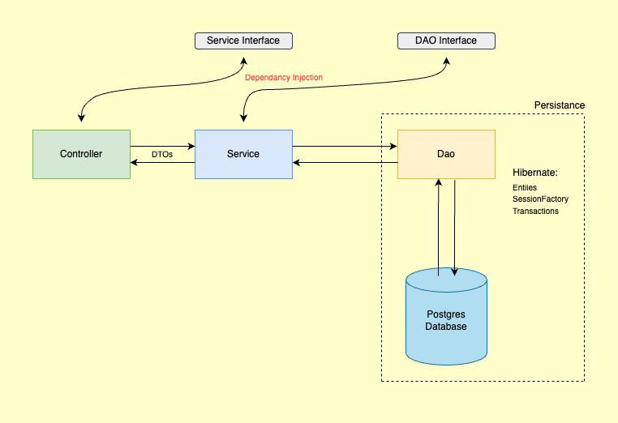

# <b>Online-Gallery-Demo-Service</b>
Spring authentication and authorisation with file upload

### Features:
* spring security (authentication and authorization using JWT)
* multiple file upload (images)
* Postgress database
* Hibernate Search

### Architecture:



### How to run:
After making changes to the code, navigate to the projects root directory and run the following commands<br>
```mvn clean install```<br>
```docker compose -f ./docker-compose.yaml up -d```<br>

### APIs
[API Specification](http://localhost:8075/spring-image-upload/swagger-ui/index.html)

### Client Apps
[Repository to client apps](https://github.com/tbandawa/online-gallery-demo-apps)
